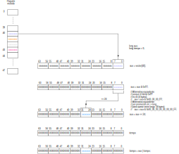
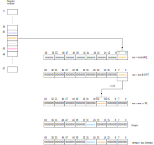
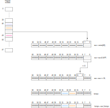
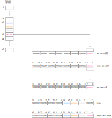
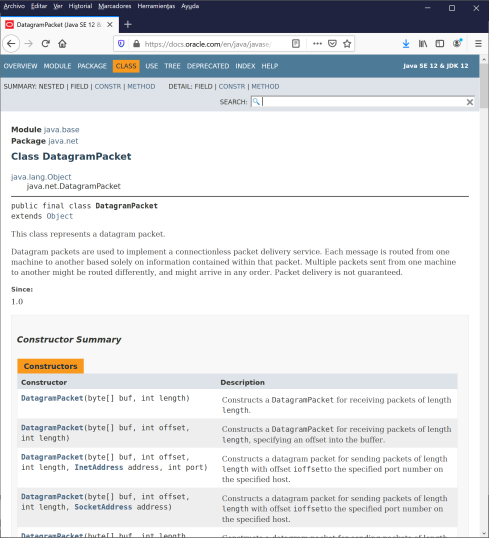

<h3 align="center">Aplicaciones Telemáticas</h3>


<h1 align="center"><b>Reloj basado en NTP con Java</b></h1>
<h3 align="center"><b>Práctica 1</b></h3>

<h4 align="center"><b>P. Beneit Mayordomo</b></br><b>J. E. López Patiño</b><br>
<b>F. J. Martínez Zaldívar</b></h4>


<h3 align="center">Grado en Ingeniería de Tecnologías y Servicios de Telecomunicación</h3>
<h3 align="center">ETSIT-UPV</h3>


# 1. Introducción y objetivos

En la presente práctica el alumno implementará en Java un sencillo
programa con el que mostrará la hora obtenida de un servidor de tiempo,
empleando los paquetes UDP que se transfieren en el protocolo NTP
*(Network Time Protocol)*.

El alumno deberá ser capaz de realizar la edición y compilación de
ficheros Java así como de entender mínimamente el formato del paquete
UDP de NTP, interpretarlo correctamente y deducir la hora local con las
correcciones oportunas. Tanto la compilación como la ejecución se
llevará a cabo en línea de comandos, sin utilizar ningún IDE
*(Integrated Development Environment)*.

Ténganse en cuenta las consideraciones comentadas en todo el presente
documento para evitar que cualquier incumplimiento implique una merma en
la calificación.

La práctica deberá ser realizada por el grupo de alumnos en una sesión de prácticas de dos horas. Se sugiere que el presente documento haya sido leído previamente a la realización de la práctica.

## 1.1 Software y hardware necesario

Será necesario tener instalado el **JDK** (Java Development Kit) de
Java, accesible en línea de comandos. Adicionalmente se requerirá un
editor de texto plano, como por ejemplo **Visual Studio Code** o
cualquier otro equivalente, y el sistema de control de versiones
**Git**. Cualquier máquina con cualquier sistema operativo, este
software y conexión a internet será suficiente para poder realizar la
presente práctica.

## 1.2 Aplicación a realizar


La ejecución de la aplicación debe simplemente mostrar en una ventana
con línea de comandos, la hora en el instante de ejecución en formato
`hh:mm:ss`, con <code>hh&isin;[0...23]</code> y <code>mm,ss&isin;[0...59]</code>. Se deberán
hacer las correcciones oportunas en función del huso horario (UTC+01:00
u *obsoletamente* GMT+01:00) y del horario de verano (+0/1 h).

## 1.3. Repositorio compartido


Cada grupo de prácticas (formado por uno o por dos alumnos) comparte un
repositorio con la organización de GitHub `AATT-ETSIT-20-21`, con la
denominación `AATT-ETSIT-20-21/Pr1-<NOMBRE_DEL_GRUPO>`, siendo
`<NOMBRE_DEL_GRUPO>` la denominación con la que se creó el grupo.


Antes de comenzar la práctica, el alumno deberá primeramente verificar
que `git` está instalado en el ordenador. En caso de no estarlo, se
deberá proceder con la instalación según el procedimiento explicado en
un repositorio de `AATT-ETSIT-20-21` dedicado a ello.


Cada miembro integrante del grupo deberá tener su propia copia del repositorio, ya que la intención es dividir el trabajo y resolver el problema conjuntamente.
Para ello, se debe abrir una ventana en línea de comandos
(`Git Bash`, `Windows CMD`, `Windows Powershell`, ...) desde un directorio oportuno y realizar la clonación del repositorio remoto:

```bash
git clone <URL_REPOSITORIO_REMOTO> <RAIZ_REPO_LOCAL>
```

Donde `<URL_REPOSITORIO_REMOTO>` es la URL del repositorio compartido de
la práctica (que se puede obtener desde la página web de GitHub abierta
en el repositorio de la práctica) y `<RAIZ_REPO_LOCAL>`, el directorio destino.
Recuérdese que si `<RAIZ_REPO_LOCAL>` es especificado con un punto (`.`), entonces,
el directorio en el que se ha ejecutado la clonación, será el directorio
de trabajo y en él se descargará todo el repositorio remoto. Si no se
indica nada, se crea una carpeta con el nombre del repositorio remoto y
ahí se incluirá todo el directorio de trabajo; si `<RAIZ_REPO_LOCAL>` es un nombre
convencional, se crea una carpeta con dicho nombre (si no existe, y si
existe debería estar vacía ya que en caso contrario se produce une
error) y ahí se incluirá todo el directorio de trabajo. Recuérdese que por defecto,
tras la clonación, el alias del repositorio remoto será `origin` y la
rama de trabajo, `master`.


Bajo el directorio local elegido, tras la clonación debe existir entre otros, el presente
documento `README.md` así como una carpeta denominada `java`, con cierta
estructura de directorios y ficheros que habrá que completar o modificar
como desarrollo de la práctica:


```
<RAIZ_REPO_LOCAL>
    ├── README.md
    ├── figuras
    │   └── ...
    └── java
        ├── auxiliar
        │   └── Utiles.java
        └── test
            ├── TestNTP.java
            └── TestUtiles.java
```            

**Importante:** un instante antes de finalizar la sesión de prácticas, al menos uno de los integrantes del grupo, debe subir obligatoriamente el repositorio local desde el ordenador
utilizado en la sesión de prácticas al repositorio remoto (GitHub). El
*commit* que represente el estado de la práctica al finalizar la sesión
debe estar alojado en la rama `master` y tener una etiqueta o `tag` con
el valor `"pr1.sesion.fin"`. Recuérdese que para que el repositorio
remoto (GitHub) esté efectivamente actualizado con el local, se debe
ejecutar el comando `git push origin master` (típicamente el alias del
repositorio remoto suele ser `origin` y la rama de trabajo por defecto,
`master`, aunque depende de cómo el grupo esté trabajando o haya
configurado su trabajo). Recuérdese que las etiquetas hay que subirlas
hacia el respositorio remoto explícitamente con el comando
`git push origin –-tags`. Si se especifica
`git push origin master –-tags`, además de las etiquetas, se actualiza en
remoto la rama `master`.

Tras hacer esta operación, se sugiere que se reabra, mediante un
navegador, el sitio GitHub correspondiente con el repositorio remoto y
que se compruebe que efectivamente, está todo subido: tanto los
*commits* correspondientes a la o las ramas de trabajo, como la
etiqueta. Es **importante** que se lleve a cabo esta verificación.

A lo largo del desarrollo de la práctica, el grupo es completamente
libre de actualizar el repositorio local o remoto como lo estime
oportuno, con las ramas o los *commits* que estimen necesarios, pero
respetando los *commits* y *tags* comentados anteriormente, como puntos de control. La forma de trabajar
se denomina genéricamente *workflow* y convendría aclararla antes de comenzar, es decir, repartir las tareas y utilizar las herramientas que el propio GitHub proporciona para llevar a cabo la comunicación entre los integrantes del grupo. Se valorará que haya una intensa interacción con el repositorio remoto.

Se dispondrán de 3 días lectivos adicionales para finalizar algún detalle que
pudiera haber quedado pendiente, en cuyo caso deberá de nuevo subirse la
versión definitiva con el *commit* que se considere el final, con el
`tag` `"pr1.fin"` y también en la rama `master`.

Si la práctica se finaliza en la misma sesión de prácticas, las dos etiquetas `pr1.sesion.fin` y `pr1.fin` convivirán en el mismo *commit*.


# 2. NTP


## 2.1. Protocolo


NTP o *Network Time Protocol*, versión 4, puede encontrarse en la RFC
5905, en una de sus últimas versiones que data de junio de 2010. En los
documentos RFC 5906, 5907 y 5908 puede encontrarse información
adicional. En otras RFC, como 958, 1305 o 4330 aparecen versiones
anteriores de este protocolo.

NTP es un protocolo empleado ampliamente para sincronizar los relojes de
computadores conectados a Internet.

## 2.2. Formatos de tiempos en NTP


Existen tres formatos de tiempo en NTP: *NTP Short Format*, *NTP
Timestamp Format* y *NTP Date Format* (véase la [figura 1](#fig:fig1).
Nosotros utilizaremos el denominado *NTP
Timestamp Format*, mostrado como segunda subfigura dentro de la
figura [figura 1](#fig:fig1), en el que el tiempo se codifica con formato
de punto o coma fija. Con este formato se dedican 32 bits **sin signo**
a la parte entera de la cantidad de segundos que han transcurrido desde
el 1 de enero del año 1900, y otros 32 bits también sin signo para para
la parte fraccionaria.

<div id="fig:fig1">

```
                    0                   1                   2                   3
                    0 1 2 3 4 5 6 7 8 9 0 1 2 3 4 5 6 7 8 9 0 1 2 3 4 5 6 7 8 9 0 1
                    +-+-+-+-+-+-+-+-+-+-+-+-+-+-+-+-+-+-+-+-+-+-+-+-+-+-+-+-+-+-+-+-+
                    |          Seconds              |           Fraction            |
                    +-+-+-+-+-+-+-+-+-+-+-+-+-+-+-+-+-+-+-+-+-+-+-+-+-+-+-+-+-+-+-+-+

                                            NTP Short Format

                    0                   1                   2                   3
                    0 1 2 3 4 5 6 7 8 9 0 1 2 3 4 5 6 7 8 9 0 1 2 3 4 5 6 7 8 9 0 1
                    +-+-+-+-+-+-+-+-+-+-+-+-+-+-+-+-+-+-+-+-+-+-+-+-+-+-+-+-+-+-+-+-+
                    |                            Seconds                            |
                    +-+-+-+-+-+-+-+-+-+-+-+-+-+-+-+-+-+-+-+-+-+-+-+-+-+-+-+-+-+-+-+-+
                    |                            Fraction                           |
                    +-+-+-+-+-+-+-+-+-+-+-+-+-+-+-+-+-+-+-+-+-+-+-+-+-+-+-+-+-+-+-+-+

                                            NTP Timestamp Format

                    0                   1                   2                   3
                    0 1 2 3 4 5 6 7 8 9 0 1 2 3 4 5 6 7 8 9 0 1 2 3 4 5 6 7 8 9 0 1
                    +-+-+-+-+-+-+-+-+-+-+-+-+-+-+-+-+-+-+-+-+-+-+-+-+-+-+-+-+-+-+-+-+
                    |                           Era Number                          |
                    +-+-+-+-+-+-+-+-+-+-+-+-+-+-+-+-+-+-+-+-+-+-+-+-+-+-+-+-+-+-+-+-+
                    |                           Era Offset                          |
                    +-+-+-+-+-+-+-+-+-+-+-+-+-+-+-+-+-+-+-+-+-+-+-+-+-+-+-+-+-+-+-+-+
                    |                                                               |
                    |                           Fraction                            |
                    |                                                               |
                    +-+-+-+-+-+-+-+-+-+-+-+-+-+-+-+-+-+-+-+-+-+-+-+-+-+-+-+-+-+-+-+-+

                                            NTP Date Format

```
<p  align="center"><b>Figura 1</b>: formatos de tiempo en NTP</p>
</div>


## 2.3. Paquetes UDP


El protocolo NTP emplea exclusivamente paquetes UDP. En la práctica se
*rellenará* un paquete UDP para realizar una petición de tiempo a un
servidor y este responderá con otro paquete UDP con la información
requerida.

En la RFC 5905 aparece la estructura del paquete y también las distintas
formas de representar el tiempo. La versión básica sin extensiones
consta de **48 octetos** (numerados del 0 al 47). La
[figura 2](#fig:fig2) reproduce este formato, donde la
representación de la información es *big endian* (los octetos se
almacenan y transmiten de izquierda a derecha, de arriba a abajo). En
cada fila se muestran 32 bits numerados desde 00 hasta el 31, es decir,
4 octetos; tenemos un total de 12 filas, por lo que el paquete constará
efectivamente de 48 octetos, tal y como hemos comentado anteriormente.
Existen campos adicionales que son opcionales y sin interés para la
presente práctica.


<div id="fig:fig2">

```
                    0                   1                   2                   3
                    0 1 2 3 4 5 6 7 8 9 0 1 2 3 4 5 6 7 8 9 0 1 2 3 4 5 6 7 8 9 0 1
                    +-+-+-+-+-+-+-+-+-+-+-+-+-+-+-+-+-+-+-+-+-+-+-+-+-+-+-+-+-+-+-+-+
                    |LI | VN  |Mode |    Stratum     |     Poll      |  Precision   |
                    +-+-+-+-+-+-+-+-+-+-+-+-+-+-+-+-+-+-+-+-+-+-+-+-+-+-+-+-+-+-+-+-+
                    |                         Root Delay                            |
                    +-+-+-+-+-+-+-+-+-+-+-+-+-+-+-+-+-+-+-+-+-+-+-+-+-+-+-+-+-+-+-+-+
                    |                         Root Dispersion                       |
                    +-+-+-+-+-+-+-+-+-+-+-+-+-+-+-+-+-+-+-+-+-+-+-+-+-+-+-+-+-+-+-+-+
                    |                          Reference ID                         |
                    +-+-+-+-+-+-+-+-+-+-+-+-+-+-+-+-+-+-+-+-+-+-+-+-+-+-+-+-+-+-+-+-+
                    |                                                               |
                    +                     Reference Timestamp (64)                  +
                    |                                                               |
                    +-+-+-+-+-+-+-+-+-+-+-+-+-+-+-+-+-+-+-+-+-+-+-+-+-+-+-+-+-+-+-+-+
                    |                                                               |
                    +                      Origin Timestamp (64)                    +
                    |                                                               |
                    +-+-+-+-+-+-+-+-+-+-+-+-+-+-+-+-+-+-+-+-+-+-+-+-+-+-+-+-+-+-+-+-+
                    |                                                               |
                    +                      Receive Timestamp (64)                   +
                    |                                                               |
                    +-+-+-+-+-+-+-+-+-+-+-+-+-+-+-+-+-+-+-+-+-+-+-+-+-+-+-+-+-+-+-+-+
                    |                                                               |
                    +                      Transmit Timestamp (64)                  +
                    |                                                               |
                    +-+-+-+-+-+-+-+-+-+-+-+-+-+-+-+-+-+-+-+-+-+-+-+-+-+-+-+-+-+-+-+-+
```
<p  align="center"><b>Figura 2</b>: estructura de paquete UDP de NTP</p>
</div>


El significado de los campos que aparecen en la
figura [figura 2](#fig:fig2) es el siguiente (aunque en la práctica se
empleará un subconjunto mínimo de estos tal y como hemos comentado
anteriormente):

-   `LI`: *(Leap Indicator)*: indicador de salto (2 bits)

    | *Valor* | *Significado* |
    | ------- | :------------------------------------------- |
    |   00     | Sin advertencia |
    |   01     | El último minuto del día tendrá 61 segundos |
    |   10     | El último minuto del día tendrá 59 segundos |
    |   11    |  Reloj no sincronizado (o valor desconocido) |

-   `VN` *(Version Number)*: número de versión (3 bits, actualmente la
    versión es la 4: 100)

-   `Mode`: modo o rol asumido en el protocolo

    | *Valor* | *Significado*|
    |---------|:--------------|
    |   000   | Reservado|
    |   001   | Activo simétrico|
    |   010   | Pasivo simétrico|
    |   011   | Cliente|
    |   100   | Servidor|
    |   101   | Broadcast|
    |   110   | Mensaje de control NTP|
    |   111   | Reservado|

-   `Stratum`: estrato o nivel (8 bits) al que pertenece el servidor

    | *Valor*  |*Significado*|
    |--------- |:-------------|
    |    0     |Sin especificar o inválido|
    |    1     |Servidor primario (equipado con receptor GPS)|
    |  2<span>&#x2014;</span>15   |Servidor secundario (vía NTP)|
    |   16     |Desincronizado|
    | 17<span>&#x2014;</span>255  |Reservado|

-   `Poll` (8 bits con signo): máximo intervalo entre mensajes sucesivos (dado
    en log<sub>2</sub> segundos, por ejemplo, un valor de 6 significaría envío
    de mensajes cada 2<sup>6</sup>=64 segundos). Valores típicos: entre 6 y 10.

-   `Precision` (8 bits con signo): precisión del sistema de reloj en log<sub>2</sub>
    segundos. Por ejemplo, un valor de -18 implicaría una precisión de
    2<sup>-18</sup>&#x2248;3&#x00b7;10<sup>-6</sup>, es decir, del orden del microsegundo

-   `Root delay`: tiempo de retardo de ida y vuelta total hasta el reloj de
    referencia en formato *NTP short format* (32 bits)

-   `Root dispersion`: dispersión respecto al reloj de referencia en formato *NTP short
    format* (32 bits)

-   `Reference ID`: identificación de la referencia (32 bits). Estos 32 bits se
    interpretan como cuatro caracteres ASCII *(kiss code)* para estratos
    0 y 1; para estratos superiores es la dirección IPv4 (si se utiliza
    IPv6, entonces son los cuatro primeros octetos del *hash* MD5 de la
    dirección IPv6)

     |      |  Fuente                                  |
     |:-----|:-----------------------------------------|
     |GOES   |Geosynchronous Orbit Environment Satellite|
     | GPS    |Global Position System|
     | GAL    |Galileo Positioning System|
     | PPS    |Generic pulse-per-second|
     | IRIG   |Inter-Range Instrumentation Group|
     | WWVB   |LF Radio WWVB Ft. Collins, CO 60 kHz|
     | DCF    |LF Radio DCF77 Mainflingen, DE 77.5 kHz|
     | HBG    |LF Radio HBG Prangins, HB 75 kHz|
     | MSF    |LF Radio MSF Anthorn, UK 60 kHz|
     | JJY    |LF Radio JJY Fukushima, JP 40 kHz, Saga, JP 60 kHz|
     | LORC   |MF Radio LORAN C station, 100 kHz|
     | TDF    |MF Radio Allouis, FR 162 kHz|
     | CHU    |HF Radio CHU Ottawa, Ontario|
     | WWV    |HF Radio WWV Ft. Collins, CO|
     | WWVH   |HF Radio WWVH Kauai, HI|
     | NIST   |NIST telephone modem|
     | ACTS   |NIST telephone modem|
     | USNO   |USNO telephone modem|
     | PTB    |European telephone modem|

-   `Reference Timestamp`: tiempo cuando el reloj fue ajustado por última vez en formato *NTP
    timestamp* (64 bits)

-   `Origin Timestamp`: tiempo en el cliente en el momento de hacer la petición hacia el
    servidor, en formato *NTP timestamp* (64 bits)

-   `Receive Timestamp`: tiempo en el servidor, en el momento en el que llegó la petición
    del cliente, en formato *NTP timestamp* (64 bits)

-   `Transmit Timestamp`: tiempo en el servidor, en el momento en que que envió la respuesta
    hacia el cliente, en formato *NTP timestamp* (64 bits)


# 3. Detalles de implementación del ejercicio


<div id="subsec:init"></div>

## 3.1. Preparación del paquete UDP de envío hacia el servidor 


De todo el paquete UDP de 48 bytes, los únicos campos con información
necesaria para efectuar la petición son la versión, `VN=4` (`100` en binario)
y el modo, `Mode=3` (`011` en binario), ambos en el octeto número `0` del paquete;
es decir que el primer octeto deberá contener un
```
00 100 011 = 0010 0011 = 0x23 = 35 
```
El resto de los
octetos que forman el paquete UDP de la petición de tiempo pueden estar
perfectamente a 0.

## 3.2. Tratamiento del paquete UDP recibido desde el servidor


El formato del paqute UDP recibido es idéntico al transmitido. El campo
que nos interesa es el de `Transmit Timestamp`, cuya parte entera (32 bits) se haya ubicada
en los octetos 40<span>&#x2014;</span>43 (obviaremos los 32 bits correspondientes a la
parte fraccionaria ubicada en los octetos 44<span>&#x2014;</span>47). A estos 32 bits de la
parte entera correspondiente a la cantidad de segundos transcurridos
desde el 1 de enero de 1900, la denominaremos 
<code>t<sub>NTP</sub></code>
o
simplemente `tiempo` (existen otras referencias temporales como el
tiempo UNIX que es la cantidad de segundos transcurridos desde el 1 de
enero de 1970).

### 3.2.1. Tipos de datos en Java

La parte entera del tiempo NTP está codificada con 32 bits, luego parece
oportuno, a priori, emplear como tipo de datos en Java ya que estos se
plasman en 32 bits. Pero tenemos un problema potencial de rango en la
representación, ya que este tiempo está codificado con 32 bits sin
signo, pero los tipos numéricos simples de Java son con signo en
complemento a 2, luego su rango está en el intervalo

<p style="text-align:center">
[-2<sup>31</sup> &#x2026; 2<sup>31</sup>-1] = [-2&#x202f;147&#x202f;483&#x202f;648 &#x2026; 2&#x202f;147&#x202f;483&#x202f;647],
</p>

y, por ejemplo, el 31 de diciembre de 1999 ya tenía el tiempo NTP
<code>t<sub>NTP</sub></code>=3&#x202f;155&#x202f;587&#x202f;200 s, lo cual ya estaría fuera de rango,
luego el tipo producirá interpretaciones incorrectas de las magnitudes;
es por ello que necesitaremos un tipo de datos de Java que albergue más
bits, es decir, el tipo , que codifica enteros con signo en 64 bits, con
el que ya no tendremos este problema, ya que su rango es


<p style="text-align:center">
[-2<sup>63</sup> &#x2026; 2<sup>63</sup>-1] = [-9&#x202f;223&#x202f;372&#x202f;036&#x202f;854&#x202f;775&#x202f;808 &#x2026; 9&#x202f;223&#x202f;372&#x202f;036&#x202f;854&#x202f;775&#x202f;807].
</p>


En cualquier caso, aparece un problema de conversión de datos ya que
tendremos que construir un `long` a partir de 4 bytes (con los otros cuatro
bytes de mayor peso en el `long`, a cero), no existiendo ninguna
instrucción Java a tal efecto. Para ello se propone concebir una
solución que gráficamente se puede observar en las
figuras [3](#fig:4bytes2long_0),
[4](#fig:4bytes2long_1),
[5](#fig:4bytes2long_2)
y [6](#fig:4bytes2long_3).


<div id="fig:4bytes2long_0">
<p align="center"><br/>

</p>
<p align="center"><b>Figura 3</b>: primera iteración en la conversión</p><br/>
</div>


En la figura [3](#fig:4bytes2long_0) se propone emplear dos variables, ambas
de tipo `long` denominadas `aux` y `tiempo` (esta inicializada a cero)
respectivamente. El primer byte ubicado en la posición 40 del paquete
UDP recibido se carga directamente en la variable `aux` (instrucción
`aux = vector[40];`). En la carga se produce una extensión de signo
(denotada con una serie de bits con la letra `s`) que para nuestros
propósitos hay que cancelar realizando la operación lógica AND con la
máscara `OxFF` (instruccion `aux = aux & 0xFF;`). A continuación, a esta
variable `aux` se le debe aplicar un desplazamiento lógico de 24
posiciones a la izquierda (instrucción `aux = aux << 24;`) para
alinearla con la posición que deberá ocupar definivamente en la variable
`tiempo`. Para homogeneizar el proceso con los siguientes pasos, esta
*carga* de `aux` en `tiempo` se ha llevado a cabo con una operación
lógica OR (instrucción `tiempo = aux | tiempo;`).

En las restantes figuras
(figuras [4](#fig:4bytes2long_1),
[5](#fig:4bytes2long_2)
y [6](#fig:4bytes2long_3)) puede observarse un proceso equivalente
para ubicar convenientemente los restantes 3 bytes en el sitio oportuno
en la variable `tiempo` de tipo `long`.


<div id="fig:4bytes2long_1">
<p align="center"><br/>

</p>
<p align="center"><b>Figura 4</b>: segunda iteración en la conversión</p><br/>
</div>


<div id="fig:4bytes2long_2">
<p align="center"><br/>

</p>
<p align="center"><b>Figura 5</b>: tercera iteración en la conversión</p><br/>
</div>


<div id="fig:4bytes2long_3">
<p align="center"><br/>

</p>
<p align="center"><b>Figura 6</b>: cuarta iteración en la conversión</p><br/>
</div>


### 3.2.2. Horas, minutos y segundos a partir del tiempo UTC

A partir de esta variable `tiempo` de tipo `long`, nos ceñiremos
exclusivamente a intentar obtener la hora dentro del día actual, el
minuto dentro de la hora actual, y el segundo dentro del minuto actual.
Para ello, ya que un minuto contiene 60 s, y una hora contiene 60 min,
es decir, 3600 s y por tanto, un día tendrá 24 h, es decir,
<span>3600 &#x00b7; 60 = 86&#x202f;400</span> s, podemos deducir fácilmente las tres
cantidades:


- <code>hora  = (tiempo % 86400 ) / 3600</code>  <span id="eq:formulas">(1)</span>
- `minutos  = (tiempo % 3600 ) / 60`
- `segundos = tiempo % 60` 


donde `%` denota la operación módulo y las divisiones son divisiones
**enteras**, y `tiempo` es el tiempo UTC obtenido del protocolo NTP (es
decir, la variable de tipo `long` obtenida de la conversión de los 4
bytes que comienzan en la posición 40 del datagrama, tal y como se ha
descrito anteriormente).

Téngase en cuenta algunas correcciones necesarias para calcular
definitivamente los resultados: el tiempo recibido es tiempo UTC y en
España, y concretamente la península Ibérica, la hora oficial es UTC+1.
Adicionalmente, y en función de cuándo se realice la práctica, debería
tenerse en cuenta la corrección de la hora local atendiendo a si se está
en horario de invierno o de verano (UTC+2 a partir de últimos de marzo). **Debe
reflexionarse** muy bien sobre esta peculiaridad tan sencilla ya que es
extremadamente fácil tomar una decisión **incorrecta** en el momento de 
elaborar el programa al abordar estos
reajustes horarios.

### 3.2.3. Indicaciones sobre el software a desarrollar

A partir de ciertas previsiones razonables y sencillas del software a
desarrollar se propone realizar la siguiente organización de ficheros
dentro del directorio de trabajo. Consideremos que estamos en el directorio 
de trabajo `java` que cuelga directamente de la raíz del repositorio clonado.

Tomando, por tanto y a partir de ahora, `java` como directorio de
referencia o trabajo, en la carpeta `auxiliar` vamos a tener un fichero
denomninado `Utiles.java` (que podría referenciarse como `auxiliar/Utiles.java`
desde el directorio de trabajo `java`)

La intención de `Utiles.java` es contener una clase con
métodos que nos resulten de utilidad para resolver ciertos problemas
sencillos y parciales de la práctica. Dada esta organización, la clase
`Utiles` deberá pertenecer al **paquete** `auxiliar`,
redenominándose por tanto la clase como `auxiliar.Utiles`.

Adicionalmente, en la carpeta `test` tendremos dos ficheros: el primero
de ellos, `TestUtiles.java` que será una clase con punto de entrada o
*entry point* (o con el método
`public static void main(String [] args)`), que utilizaremos para
verificar el correcto funcionamiento de los métodos desarrollados en la
clase `auxiliar.Utiles`; el segundo, el fichero `TestNTP.java`, también
con punto de entrada, contendrá el código necesario para efectuar esas
peticiones de tiempo y mostrar la hora en la ventana de línea de
comandos, aunque los detalles de este fichero se postponen para
sucesivas secciones. Ambos ficheros pertenecerán al **paquete** `test`.

En el repositorio de la presente práctica aparecen los ficheros
comentados anteriormente, bien íntegros, bien con contenido parcial.
Será misión del alumno completar los contenidos o modificarlos
adecuadamente para conseguir un correcto funcionamiento.

A continuación se describen con un poco más de detalle la funcionalidad
necesaria en algunos de estos ficheros:

-   Fichero `auxiliar/Utiles.java`. Debe contener:

    -   Un método que admita como parámetro un array de 4 bytes y
        devuelva un *long* correspondiente a la conversión descrita en
        subapartados anteriores, por lo que deberá implementarse. Una
        sugerencia de código incompleto puede ser la siguiente:

        ```java
        [modificadores] long de_Array4Bytes_a_Long( byte[] vector ) {
            long result;
            ... // Implementación
            return result;
        }
        ```

        Probablemente este método requerirá de ciertos modificadores de
        acceso/no acceso que el alumno debe determinar, lo cual ha sido
        denotado con `[modificadores]`.

        Para intentar verificar el correcto funcionamiento de este
        método se propone emplear lo que podríamos denominar la rutina
        inversa, es decir, aquella que a partir de un `long`, se
        extraigan sus cuatro bytes menos significativos. Este método se
        proporciona íntegramente en el fichero `auxiliar/Utiles.java`
        (inténtese entender su funcionamiento)

        ```java
        static public byte[] de_Long_a_Array4Bytes(long t) {
            byte [] vector = new byte[4];
            long aux;
            for (int i = 0; i < 4; i++) {
                aux = t >> (8*(3-i));
                vector[i] = (byte)(aux & 0xFF);
            }       
            return vector;
        }
        ```

        De modo que con la siguiente porción de código (que estará
        incluida en `TestUtiles.java`) se pueda verificar que, con alta
        probabilidad, el funcionamiento de los métodos es el esperado.

        ```java
        ...
        byte [] vector = {14, 112, -78, 45};
        long t = Utiles.de_Array4Bytes_a_Long( vector );
        byte [] vector_aux = Utiles.de_Long_a_Array4Bytes( t );
        for (int i = 0; i < 4; i++ ) {
            if ( vector_aux[i] != vector[i] ) {
                System.out.println("Error en de_Array4Bytes_a_Long( byte[] ).");
                break; // Ya no es necesario continuar
            }
            System.out.println("vector_aux[" + i + "]=vector["+ i + "]=" + vector_aux[i]);
        }
        ...
        ```
        Los modificadores del    método <code>de_Long_a_Array4Bytes(&#x00b7;)</code>
        proporcionado son `static` y `public`, lo cual implica que 
        no es necesario instanciar la clase
        `auxiliar.Utiles` para utilizarlo y que 
        el acceso es público; su invocación por tanto
        sería <code>Utiles.de_Long_a_Array4Bytes(&#x00b7;)</code>. Para el método
        propuesto a implementar, <code>de_Array4Bytes_a_Long(&#x00b7;)</code>, estos
        detalles puede dar una pista sobre cuál deberían ser sus
        modficadores.

    -   Se requiere la implementación de un método que extraiga del
        tiempo UTC del instante en cuestión y guardado en una variable
        de tipo `long`, los valores correspondientes a las horas,
        minutos y segundos de ese día (según las ecuaciones
        [(1)](#eq:formulas)), devolviendo estos valores en un
        array de 3 bytes (horas, minutos y segundos). Se propone guardar
        cada uno de estos tres ítems respectivamente en sendos byte, ya que
        el rango irá de 0 a 23 para las horas y de 0 a 59 para minutos y
        segundos, los cuales caben perfectamente en variables de tipo
        `byte`, que como sabemos tienen un rango de [-128 ... 127].

        Tal y como ocurrió anteriormente, dedúzcanse cuáles serían los
        modificadores de acceso y/o no acceso apropiados para este
        método de la clase `auxiliar.Utiles`.

-   Fichero `test/TestUtiles.java`: este fichero se entrega íntegro,
    luego no hace falta modificarlo, sino simplemente entender de qué
    forma pretende validar mínimamente el contenido de la clase
    `auxiliar.Utiles` descrita en el fichero `auxiliar/Utiles.java`

Ahora es el momento oportuno para verificar que las herramientas
implementadas son correctas. Para ello se sugiere que, una vez rellenado
el fichero `auxiliar/Utiles.java`, se compile desde el directorio `java`
*vorazmente* el fichero `test/TestUtiles.java` (recuérdese que en tal
caso, el compilador de Java buscará las clases necesarias en los sitios
oportunos (según la pertenencia a sus paquetes) y si no las encuentra,
pero sí encuentra sus ficheros fuente, las intenta compilar, lo cual es
nuestro objetivo para simplificar el proceso de compilación):

```bash
javac test/TestUtiles.java
```
y que a continuación se ejecute:

```bash
java test.TestUtiles
```

Si aparecen problemas en la compilación o en la ejecución, además de
controlar la sintaxis, compruébese que los ficheros están en los
directorios oportunos íntimamente relacionados con las paquetes a los
que deben pertenecer y que la invocación tanto a `javac` como a `java`
se hacen también desde el directorio oportuno.

En los siguientes apartados se abordarán las comunicaciones con el
servidor de tiempos.


## 3.3. Comunicaciones con el servidor de tiempo: `DatagramPacket`, `DatagramSocket` e `InternetAddress`


La figura [7](#fig:NTP2)
resume de manera simbólica las conexiones ordenadas temporalmente a
realizar entre nuestro cliente y el servidor NTP.


<div id="fig:NTP2">
<p align="center"><br/>

</p>
<p align="center"><b>Figura 7</b>: modelo de funcionamiento</p><br/>
</div>


Las clases de Java para operar con datagramas o paquetes UDP serán `DatagramPacket`, 
`Datagramsocket`, e `InetAddress`.
Antes de continuar se sugiere que se eche un vistazo a la ayuda en línea
que podemos encontrar sobre algunas clases de Java, introduciendo en un
navegador como criterio de búsqueda, por ejemplo,
`Javadoc DatagramPacket Oracle`; de esta forma se mostrarán unas páginas
web con todo el detalle funcional de la clase en cuestión, tal y como
puede apreciarse en la figura [8](#fig:javadoc). Procédase de la misma manera con el resto de
clases implicadas.


<div id="fig:javadoc">
<p align="center"><br/>

</p>
<p align="center"><b>Figura 8</b>: ayuda (<code>javadoc</code>) de la clase
<code>DatagramPacket</code></p><br/>
</div>


A continuación se resume el esquema sugerido, con el cual se debería
rellenar el contenido del fichero `test/TestNTP.java`; las acciones sugeridas pueden verse reflejadas en las figuras [9](#fig:NTP3), [10](#fig:NTP4) y [11](#fig:NTP5) (los números en las figuras indican cierto orden de las acciones):

-  Crear un array de 48 bytes (por defecto, Java lo rellenará con
    ceros) que conformará el paquete UDP de NTP de petición de tiempo.

-  Inicializar el paquete UDP de NTP: simplemente escribiendo en el
    byte 0-ésimo del vector anterior lo mostrado en la subseción
    [3.1](#subsec:init).

-  Crear un *datagrama* instanciando la clase con un constructor en el
    que se debe indicar tanto el array a enviar (creado anteriormente),
    su longitud, la dirección IP destino y el puerto destino. (Búsquese
    con la ayuda de la información de tipo `javadoc`, la sobrecarga oportuna del
    constructor del `DatagramPacket`.)

    La dirección IP destino habrá que especificarla empleando un objeto
    de la clase `InetAddress`. Para ello puede emplearse el método estático 
    `InetAddress.getByName(String host)` tal que
    introduciéndole, por ejemplo, en un string la dirección IP con
    formato `xxx.xxx.xxx.xxx`, devuelve el objeto necesario para
    incluirlo como parámetro en `DatagramPacket`.

    Búsquense en internet direcciones IP de servidores NTP (el puerto
    asignado a NTP es el 123). Si la búsqueda no es fortuita o no hay
    certeza de un correcto funcionamiento, pruébese con la dirección
    130.206.3.166 correspondiente a la máquina `hora.rediris.es`. Se debería ser
    sumamente cuidadoso de no inundar al servidor con peticiones que
    pudieran provocar la denegación del servicio.

-  Créese adicionalmente un array de 48 bytes, que será el buffer o
    paquete UDP del protocolo NTP que contendrá la respuesta recibida
    desde el servidor NTP. Con este array se creará un nuevo `DatagramPacket`, esta vez,
    para la recepción. Se empleará un constructor con una sobrecarga en
    la que sólo sea necesario indicar dicho array y su longitud (véanse
    las acciones indicadas en la
    figura [11](#fig:NTP5)).

-  A continuación se abrirá un *socket*, es decir, se creará un objeto
    instanciando la clase `DatagramSocket`, donde será necesario especificar sólo un
    puerto local (indíquese un puerto superior a 1024).

-  Ahora se enviará el datagrama que contiene la petición NTP através
    del socket empleando el método `send` de dicho objeto, cuyo parámetro será
    el `DatagramPacket` de la petición (véase la
    figura [9](#fig:NTP3)).

-  Inmediatamente se llamará al método `receive` del mismo socket utilizando como
    parámetro el `DatagramPacket` creado para la recepción; se producirá una espera o
    bloqueo hasta que llegue la respuesta del servidor.

-  El paquete UDP transmitido por nosotros llegará eventualmente al
    servidor y este responderá con un nuevo paquete UDP hacia el origen
    de la petición (es decir, nosotros, véase la
    figura [10](#fig:NTP4)).

-  La respuesta del servidor nos la encontraremos en el array de 48
    bytes empleado para instanciar el `DatagramPacket` de recepción. Los bytes 40<span>&#x2014;</span>43
    contienen con formato *big endian* los 32 bits del tiempo NTP
    (véanse las acciones indicadas en la
    figura [11](#fig:NTP5)).
    Empléense los métodos implementados en la clase `auxiliar.Utiles`
    para llevar a cabo las tareas de conversión de 4 bytes a un entero
    `long` y luego la conversión de un `long` a tres bytes con las
    horas, minutos y segundos; procédase a continuación a escribir la
    hora con el formato `hh:mm:ss`, es decir, tanto las horas como los
    minutos, como los segundos con un formato de dos dígitos.


<div id="fig:NTP3">
<p align="center"><br/>

</p>
<p align="center"><b>Figura 9</b>: Envío de petición</p><br/>
</div>


<div id="fig:NTP4">
<p align="center"><br/>

</p>
<p align="center"><b>Figura 10</b>: recepción de petición y respuesta del servidor</p><br/>
</div>


<div id="fig:NTP5">
<p align="center"><br/>

</p>
<p align="center"><b>Figura 11</b>: preparación de recepción y recepción de la respuesta</p><br/>
</div>

### 3.3.1. Excepciones

La creación de algunos de los objetos o la ejecución de algunos métodos
de los mismos requieren que ciertas excepciones sean *cazadas*. Las
excepciones que es necesario considerar pueden obtenerse de la
documentación, o simplemente de los errores de compilación. Recuérdese
que el esquema general era:

```java
try { 
    // Operaciones susceptibles de provocar excepciones 
} catch (ExcepcionAControlar e) { 
    // Tratar la excepción. En nuestro entorno de prueba no 
    // será necesario realizar ninguna acción en especial, pero 
    // en una situación más realista sí que habría que hacerlo 
} finally { 
    // Se puede dejar también vacío 
}
````


## 3.4. Ejecución

Una vez completada la clase `test.TestNTP` en el fichero
`test/TestNTP.java`, de la misma forma que verificamos la correcta
funcionalidad de `auxiliar.Utiles`, deberemos comprobar que la petición
de hora funciona correctamente:

```bash
javac test/TestNTP.java
java test.TestNTP
```


# 4. Resultados a entregar

Deben completarse correctamente los ficheros `auxiliar/Utiles.java` y
`test/TestNTP.java` para conseguir mostrar en una ventana en línea de
comandos la hora oficial actual con el formato `hh:mm:ss`.

La rúbrica a valorar será:

-   Compilación correcta de todos los ficheros fuente java

-   Ejecución de `test.TestUtiles` desde el directorio `java`

-   Ejecución de `test.TestNTP` desde el directorio `java`

-   Reajuste correcto de la hora

-   Impresión en pantalla de la hora con el formato correcto `hh:mm:ss`,
    con <code>hh&isin;[0...23]</code> y <code>mm,ss&isin;[0...59]</code>.


Recuérdese subir al repositorio el resultado de la realización de la
práctica según lo expuesto al principio de la memoria de la práctica.

Ténganse en cuenta todos los detalles comentados para evitar una merma
en calificación de la misma.


